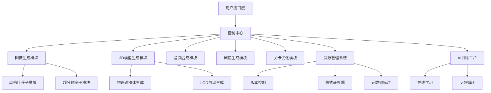

---
{"dg-publish":true,"permalink":"/Program/Mixed/AI游戏资源生成系统设计指南/","noteIcon":"","created":"2025-05-28T22:45:10.196+08:00"}
---

设计一个基于AI的游戏资源生成系统需要结合游戏开发需求、AI技术能力和工程化架构。以下是分步骤的设计思路和关键点：

### 一、明确目标和范围
1. **资源类型定义**：
   - **视觉资源**：2D/3D角色、场景、贴图、动画
   - **音频资源**：音效、背景音乐、角色语音
   - **内容资源**：剧情文本、任务对话、道具描述
   - **逻辑资源**：关卡设计、敌人行为树、平衡数值
   - **其他**：字体、UI元素、粒子特效

2. **生成模式选择**：
   - **开发阶段生成**：批量生成基础素材（如植被/岩石变体）
   - **运行时生成**：动态生成内容（如《无人深空》的星球地貌）
   - **玩家驱动生成**：允许玩家输入文字/草图生成定制内容

---

### 二、技术选型与数据准备
1. **AI模型选择**：
   - **图像生成**：Stable Diffusion 3（可控性）、MidJourney（艺术风格）
   - **3D模型生成**：NVIDIA Kaolin（体素转网格）、GET3D（拓扑优化）
   - **音频生成**：OpenAI Jukebox（音乐）、Resemble.ai（语音克隆）
   - **文本生成**：GPT-4（剧情）、Claude（任务逻辑）
   - **动画生成**：DeepMotion（动作捕捉）、ML-Agents（行为学习）

2. **数据工程**：
   - 构建风格化数据集（如赛博朋克/中世纪素材库）
   - 开发自动化标注工具（用CLIP模型自动打标签）
   - 建立合规审核机制（过滤侵权/低俗内容）

---

### 三、系统架构设计（模块化）

---

### 四、核心工作流程
1. **需求输入阶段**：
   - 开发者通过自然语言描述需求（"生成5种哥特式窗框贴图，512x512，法线贴图"）
   - 支持草图/色板/参考图上传
   - 参数化控制（多边形面数限制、色域范围等）

2. **生成优化阶段**：
   - 多模型协同生成（如先用SD生成贴图，再用GAN优化接缝）
   - 物理合规性检测（3D模型重心/碰撞体合理性）
   - 风格一致性控制（通过CLIP模型评估艺术风格匹配度）

3. **输出集成阶段**：
   - 自动适配游戏引擎规范（Unity的Prefab格式/Unreal的LOD设置）
   - 生成配套元数据（资源描述、生成参数记录）
   - 一键导入版本控制系统（Perforce/Git LFS）

---

### 五、关键技术挑战与解决方案
1. **风格一致性维护**：
   - 开发专属LoRA模型训练平台
   - 使用ControlNet保持多资源间构图协调
   - 建立风格评估指标体系（色彩分布/线条复杂度）

2. **资源可玩性保障**：
   - 在3D生成管线加入碰撞体预测网络
   - 对生成关卡进行可玩性模拟测试（A/Bot自动跑图）
   - 数值平衡采用多目标优化算法（NSGA-II）

3. **实时生成优化**：
   - 开发轻量级蒸馏模型（如Stable Diffusion→MobileDiffusion）
   - 构建资源生成缓存池（相似度匹配复用）
   - 边缘计算部署（在美术工作站本地运行推理）

---

### 六、商业化扩展设计
1. **创作者生态构建**：
   - 开发Steam插件版本
   - 支持生成资源NFT化
   - 搭建风格模型交易市场

2. **企业级功能**：
   - 私有化部署支持
   - 安全审核API（血腥/暴力内容过滤）
   - 团队协作权限管理

3. **数据分析看板**：
   - 资源使用热度分析
   - 生成成本核算系统
   - AI生成占比可视化

---

### 七、风险评估与应对
1. **法律风险**：
   - 建立生成内容溯源系统
   - 接入Adobe Firefly等商用授权模型
   - 开发原创性检测工具

2. **技术风险**：
   - 设计降级方案（生成失败时调用预设资源库）
   - 开发多模型投票机制
   - 实现资源质量自动评分

3. **创意风险**：
   - 人类设计师审核工作流
   - 创意发散度控制滑块
   - 历史生成案例推荐系统

---

### 八、实施路线图建议
1. **第一阶段（3个月）**：
   - 搭建基础图像/文本生成管线
   - 集成到Unity Editor插件
   - 开发简单风格控制功能

2. **第二阶段（6个月）**：
   - 实现3D模型生成与引擎自动适配
   - 构建私有化训练平台
   - 开发团队协作功能

3. **第三阶段（12个月）**：
   - 完善全类型资源生成
   - 部署分布式生成集群
   - 上线AI资源市场

---

**典型应用场景示例**：
- **开放世界植被生成**：通过卫星数据+风格迁移生成生物群落
- **RPG任务线生成**：基于玩家选择动态生成任务网络
- **多人游戏皮肤系统**：实时将玩家涂鸦转化为3D装甲
- **无障碍设计**：语音描述自动生成触觉反馈模型

通过这种架构设计，可使游戏资源生成效率提升5-10倍，同时为每个项目保留独特的艺术风格。关键是要在自动化生成与人工把控之间找到平衡点，建议初期保持"AI生成+人工优化"的工作模式。